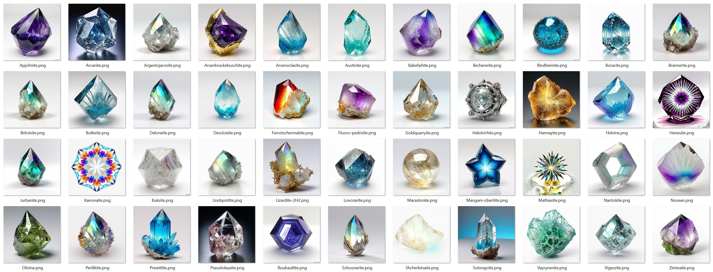

# Stable Diffusion Automation #
**Automating Stable diffusion API with PowerShell**



## Check latest updates and tutorials [developerbastian.tech](https://developerbastian.tech/) ##

## File in this repository ##
- SD_Automate.ps1
	- Features:
		- Query a Stable Diffusion API 
		- Steer prompts from JSON file (your json objects need to have two properties: 'Picture Prompt' (The prompt to be used in addition to the local variable '$prompt') and 'Name' (The name of the resulting *.png file. The name will be extended if more than one file )
		- Automatic renaming of files for batch size > 1
		- uses PowerShell 
	- All links for models, LORAs etc used are in the header of this File
- SD_Start.ps1
	- Update and start a stable diffusion local install
- Minerals.json
	- 3k mineral names and properties from [Kaggle](https://www.kaggle.com/datasets/vinven7/comprehensive-database-of-minerals/data)
	- extended the original data set by several descriptions inventing the properties of the minerals using a LLM
	- created prompts using a LLM to be usable here in image generation, retrieved from the made up properties

## Video ##
later...

## Installation ##

### PowerShell ###
Normally, you should have PowerShell installed on Windows - open a cmd window and run
```
powershell
```
If you don't have it yet, install it via 
```
winget install Microsoft.Powershell
```
or via the downloadable [setup](https://learn.microsoft.com/de-de/powershell/scripting/install/installing-powershell-on-windows?view=powershell-7.4#installing-the-msi-package)

### [Stable Diffusion Web UI](https://github.com/AUTOMATIC1111/stable-diffusion-webui) ###
- Prerequisites are Python and git installation:
	- Install [Python 3.10.6](https://www.python.org/downloads/release/python-3106/) (Newer version of Python does not support torch), checking "Add Python to PATH".
	- Install [git](https://git-scm.com/download/win).
	- Download the stable-diffusion-webui repository, for example by running git clone https://github.com/AUTOMATIC1111/stable-diffusion-webui.git.
	- Run webui-user.bat from Windows Explorer as normal, non-administrator, user.
- the model and LORA used are defined with links in 'SD_Automate.ps1' - both need to be downloaded and put in their regrading SD directories

### Running the script ###
- open 'SD_Automate.ps1'
- check the header variables for all settings
- open PowerShell prompt and start 'SD_Automate.ps1'. 

This will load all names and prompts from the provided json file and create the batch size defined in the file per name.
For more advanced settings like scheduler, sampler, steps, cfg scroll down to the bottom of 'SD_Automate.ps1'